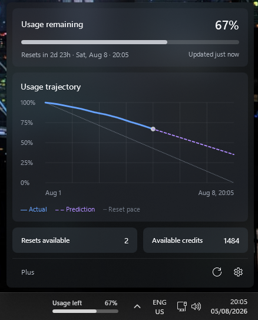

<p align="center">
  
</p>

<h1 align="center">Limit Lens</h1>

<p align="center">
  Your Codex limit, always visible.<br>
  A polished Windows taskbar companion with a glanceable usage bar and a focused forecast.
</p>

<p align="center">
  Windows 10/11 · Self-contained · Privacy-first · MIT licensed
</p>

<p align="center">
  Independent community project; not affiliated with or endorsed by OpenAI.
</p>

## Screenshot

<p align="center">
  
</p>

The screenshot was captured in isolated showcase mode with synthetic account
values. Showcase mode does not read local Codex sessions or write local app data.

## See your runway without breaking focus

Limit Lens places a compact percentage bar beside the Windows notification
area. Click it for the details that matter: how much usage remains, when the
window resets, and whether your current pace is likely to last.

No browser tab. No account page. No noisy dashboard.

## What you get

- **Usage remaining** — a persistent taskbar bar with the exact percentage left
- **Reset timing** — a live countdown plus the full reset date and time
- **Usage trajectory** — a smooth curve built from real recorded snapshots
- **Forecasting** — a recent-pace prediction alongside the sustainable reset pace
- **Credits** — optional available-credit and reset-credit cards when supplied
- **Freshness** — automatic refresh, stale-data visibility, and manual refresh
- **Alerts** — deduplicated warnings at 25%, 10%, and 0% remaining
- **Native behavior** — startup support, Explorer-restart recovery, tray access,
  light mode, and dark mode

## Designed to stay out of the way

The taskbar indicator answers the everyday question immediately. The flyout
opens only when requested and closes when focus moves elsewhere. Settings are
kept separate from the usage view, and optional account details disappear when
they are unavailable.

New installations start with sensible defaults:

- dark appearance;
- start with Windows;
- show available credits; and
- usage alerts enabled.

## Privacy by construction

Limit Lens reads supported account-limit data from `codex app-server` and
extracts a deliberately limited set of metadata from local Codex session logs.
It does not index or persist prompts, responses, command text, tool arguments,
workspace file contents, `auth.json`, or Codex-owned databases.

Account-wide values and this-device analytics stay separate. Read the complete
[privacy policy](PRIVACY.md).

## Download

Download the installer or portable ZIP from the
[latest GitHub release](../../releases/latest). Showcase packages are for
maintainer testing and are not end-user release assets.

### Installer

The recommended per-user installer requires no administrator access. It adds
Limit Lens to the Start Menu and provides a normal uninstall entry.

Version 0.1.0 is not code-signed, so Windows may display a Microsoft Defender
SmartScreen warning. Verify the download against the release's
`SHA256SUMS.txt` before running it.

### Portable

The portable ZIP contains a self-contained `win-x64` build. Extract it and run
`LimitLens.exe`. The included `portable.flag` keeps settings and aggregates in
the neighboring `Data` directory.

The application does not require a separately installed .NET runtime.

### Verify a download

Run the following and compare the resulting hash with the matching line in
`SHA256SUMS.txt`:

```powershell
Get-FileHash .\LimitLens-Setup-0.1.0-win-x64.exe -Algorithm SHA256
```

## Requirements

- Windows 10 version 2004 or newer, or Windows 11
- x64 processor
- Codex installed for account-level limits

Local analytics remain available while account data is offline or unavailable.

## Build from source

Install the .NET 10 SDK, then run:

```powershell
dotnet restore LimitLens.slnx --locked-mode
dotnet build LimitLens.slnx -c Debug --no-restore
dotnet test LimitLens.slnx -c Debug --no-build --no-restore
```

Create the installer and portable ZIP with:

```powershell
./scripts/build-release.ps1 -Version 0.1.0
```

Pass `-SkipInstaller` when Inno Setup 6 is not installed.

Maintainers can additionally create the isolated, synthetic showcase package
for screenshot testing. It must not be attached to a public release:

```powershell
./scripts/build-release.ps1 -Version 0.1.0 -SkipInstaller -IncludeShowcase
```

## Data locations

| Mode | Location |
|---|---|
| Installed | `%LOCALAPPDATA%\LimitLens` |
| Portable | `Data` beside `LimitLens.exe` |
| Codex input | `%CODEX_HOME%` or `%USERPROFILE%\.codex` |

Limit Lens never modifies the Codex home directory.

## License

[MIT](LICENSE)
